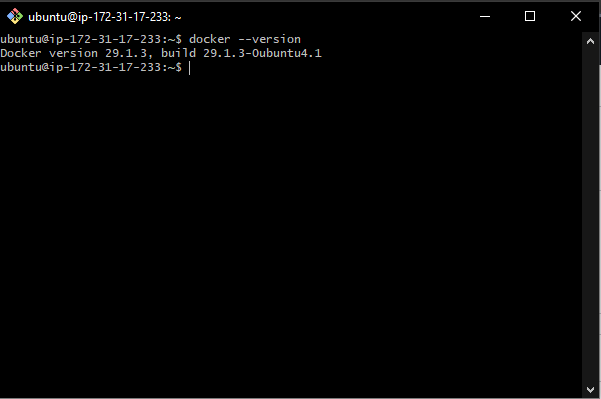
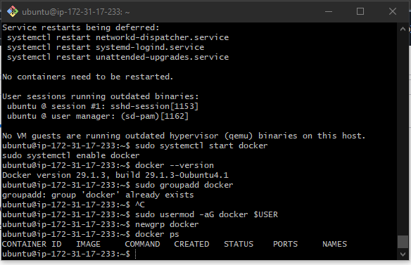
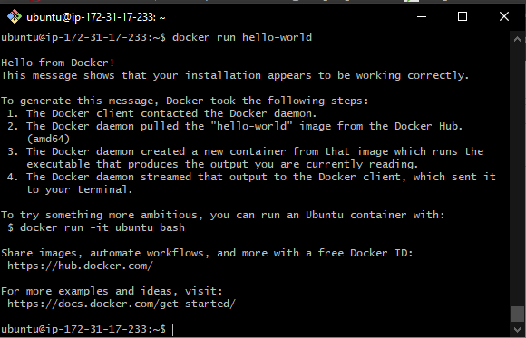
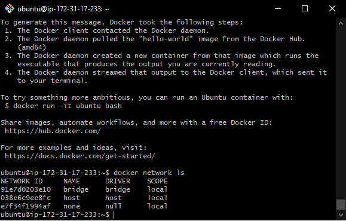
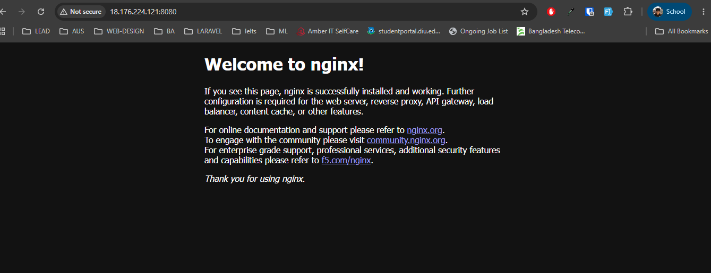
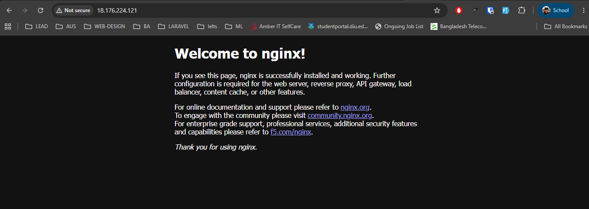
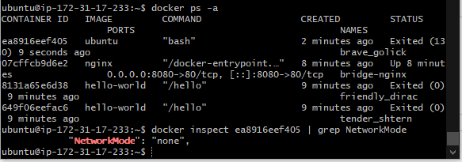
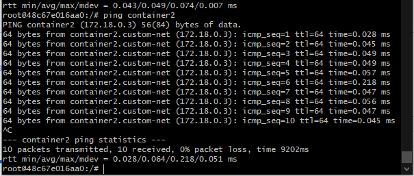

# Docker Installation and Networking on AWS EC2

# Objective

The objective of this lab is to:

* Install Docker on AWS EC2
* Configure Docker for non-root users
* Run the hello-world container
* Demonstrate Docker networking
* Understand Bridge, Host, None, and Custom Bridge networks

---


# Docker Installation

Update packages:

```bash
sudo apt update
sudo apt upgrade -y
```

Install Docker:

```bash
sudo apt install docker.io -y
```

Verify installation:

```bash
docker --version
```

Screenshot:



---

# Configure Docker for Non-Root User

```bash
sudo groupadd docker
sudo usermod -aG docker $USER
newgrp docker
```

Verification:

```bash
docker ps
```

Screenshot:



---

# Run Hello World

```bash
docker run hello-world
```

Output confirms successful installation.

Screenshot:



---

# Docker Networks

List networks:

```bash
docker network ls
```

Screenshot:



---

# Bridge Network

Inspect network:

```bash
docker network inspect bridge
```

Run nginx:

```bash
docker run -d --name bridge-nginx -p 8080:80 nginx
```

Access:

```text
http://EC2_PUBLIC_IP:8080
```

Screenshot:



---

# Host Network

Run nginx using host network:

```bash
docker run -d --name host-nginx --network host nginx
```

Access:

```text
http://EC2_PUBLIC_IP
```

Screenshot:



---

# None Network

Run container:

```bash
docker run -it --network none ubuntu bash
```

Verify:

```bash
ip addr
```

Only loopback interface exists.

Screenshot:



---

# Custom Bridge Network

Create network:

```bash
docker network create custom-net
```

Create containers:

```bash
docker run -dit --name container1 --network custom-net ubuntu bash
docker run -dit --name container2 --network custom-net ubuntu bash
```

Test communication:

```bash
ping container2
```

Screenshot:



---

# Network Types Summary

## Bridge Network

Default Docker network providing NAT-based container communication.

## Host Network

Container uses host machine networking directly.

## None Network

Container has no external networking.

## Custom Bridge Network

User-defined network with DNS-based service discovery and improved isolation.

---

